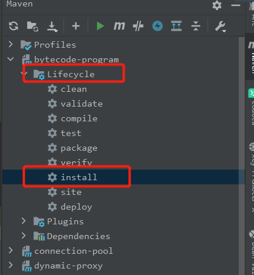
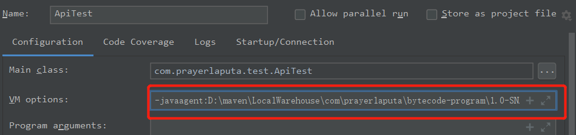

## 说明  

参考 https://github.com/fuzhengwei/itstack-demo-bytecode 学习如何利用java agent+ byte buddy实现非侵入的分布式链路追踪。

简单起见（其实就是偷懒），能共用的部分尽量共用了下，要运行一个agent，就需要：
  
（1）将agent路径修改到pom文件中  

```xml
<build>
        <plugins>
            <plugin>
                <groupId>org.apache.maven.plugins</groupId>
                <artifactId>maven-jar-plugin</artifactId>
                <version>2.3.1</version>
                <configuration>
                    <archive>
                        <manifest>
                            <addClasspath>true</addClasspath>
                        </manifest>
                        <manifestEntries>
                            <Premain-Class>
                                com.prayerlaputa.bytebuddyaop.agent.track.MyTrackAgent
                            </Premain-Class>
                        </manifestEntries>
                    </archive>
                </configuration>
            </plugin>
        </plugins>
    </build>
``` 

（2）将agent路径更新到resources/META-INF/MANIFEST.MF中  
```text
Manifest-Version: 1.0
Premain-Class: com.prayerlaputa.bytebuddyaop.agent.track.MyTrackAgent
Can-Redefine-Classes: true
```

（3）打包，我使用的是IDEA，注意需要点Lifecycle中的install，可以包编译后并放到本地maven库中


点IDEA中的Plugins可能会报错，原因参见 https://blog.csdn.net/gao_zhennan/article/details/89713407

（4）运行测试用例，注意需要在执行参数中添加-javaagent，指明agent包所在位置 
比如我用IDEA运行，就会在ApiTest执行的Config中添加参数
```text
-javaagent:你的路径/bytecode-program-1.0-SNAPSHOT.jar=传入参数
```
如图:  



## 有关链路追踪  

可以参考这篇文章：https://blog.frognew.com/2016/01/understand-distributed-tracing.html#trace%E5%92%8Cspan

## 一个完整的非侵入全链路追踪  

结合上述内容，可以实现一个功能更强大的链路追踪程序，参见 https://github.com/evasnowind/distributed-dev-learning/tree/master/monitor-by-java-agent

## 参考资料   
- https://blog.csdn.net/wanxiaoderen/article/details/107367250
- [Java Agent简介](https://www.jianshu.com/p/63c328ca208d)
- [基于Java Instrument的Agent实现](https://www.jianshu.com/p/b72f66da679f)
- https://bugstack.cn/itstack/itstack-demo-bytecode.html 
- https://blog.frognew.com/2016/01/understand-distributed-tracing.html

