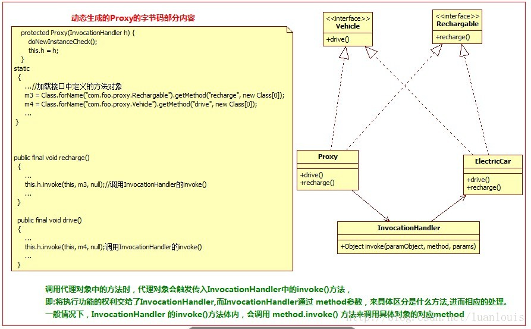

## 参考资料  
https://blog.csdn.net/luanlouis/article/details/24589193

JDK 动态代理利用反射机制来实现。可以利用JDK提供的sun.misc.ProxyGenerator.generateProxyClass(String proxyName,class[] interfaces) 底层方法来产生动态代理类的字节码，来证明这一点。




生成的动态代理利用JD-GUI后结果如下：
```java
import com.prayerlaputa.dynamicproxy.jdk.Rechargable;
import com.prayerlaputa.dynamicproxy.jdk.Vehicle;
import java.lang.reflect.InvocationHandler;
import java.lang.reflect.Method;
import java.lang.reflect.Proxy;
import java.lang.reflect.UndeclaredThrowableException;

public final class ElectricCarProxy
  extends Proxy
  implements Rechargable, Vehicle
{
  private static Method m1;
  private static Method m3;
  private static Method m2;
  private static Method m4;
  private static Method m0;
  
  public ElectricCarProxy(InvocationHandler paramInvocationHandler)
  {
    super(paramInvocationHandler);
  }
  
  public final boolean equals(Object paramObject)
  {
    try
    {
      return ((Boolean)this.h.invoke(this, m1, new Object[] { paramObject })).booleanValue();
    }
    catch (Error|RuntimeException localError)
    {
      throw localError;
    }
    catch (Throwable localThrowable)
    {
      throw new UndeclaredThrowableException(localThrowable);
    }
  }
  
  public final void recharge()
  {
    try
    {
      this.h.invoke(this, m3, null);
      return;
    }
    catch (Error|RuntimeException localError)
    {
      throw localError;
    }
    catch (Throwable localThrowable)
    {
      throw new UndeclaredThrowableException(localThrowable);
    }
  }
  
  public final String toString()
  {
    try
    {
      return (String)this.h.invoke(this, m2, null);
    }
    catch (Error|RuntimeException localError)
    {
      throw localError;
    }
    catch (Throwable localThrowable)
    {
      throw new UndeclaredThrowableException(localThrowable);
    }
  }
  
  public final void drive()
  {
    try
    {
      this.h.invoke(this, m4, null);
      return;
    }
    catch (Error|RuntimeException localError)
    {
      throw localError;
    }
    catch (Throwable localThrowable)
    {
      throw new UndeclaredThrowableException(localThrowable);
    }
  }
  
  public final int hashCode()
  {
    try
    {
      return ((Integer)this.h.invoke(this, m0, null)).intValue();
    }
    catch (Error|RuntimeException localError)
    {
      throw localError;
    }
    catch (Throwable localThrowable)
    {
      throw new UndeclaredThrowableException(localThrowable);
    }
  }
  
  static
  {
    try
    {
      m1 = Class.forName("java.lang.Object").getMethod("equals", new Class[] { Class.forName("java.lang.Object") });
      m3 = Class.forName("com.prayerlaputa.dynamicproxy.jdk.Rechargable").getMethod("recharge", new Class[0]);
      m2 = Class.forName("java.lang.Object").getMethod("toString", new Class[0]);
      m4 = Class.forName("com.prayerlaputa.dynamicproxy.jdk.Vehicle").getMethod("drive", new Class[0]);
      m0 = Class.forName("java.lang.Object").getMethod("hashCode", new Class[0]);
      return;
    }
    catch (NoSuchMethodException localNoSuchMethodException)
    {
      throw new NoSuchMethodError(localNoSuchMethodException.getMessage());
    }
    catch (ClassNotFoundException localClassNotFoundException)
    {
      throw new NoClassDefFoundError(localClassNotFoundException.getMessage());
    }
  }
}

```

1.继承自 java.lang.reflect.Proxy，实现了 Rechargable,Vehicle 这两个ElectricCar实现的接口；
2.类中的所有方法都是final 的；
3.所有的方法功能的实现都统一调用了InvocationHandler的invoke()方法。


