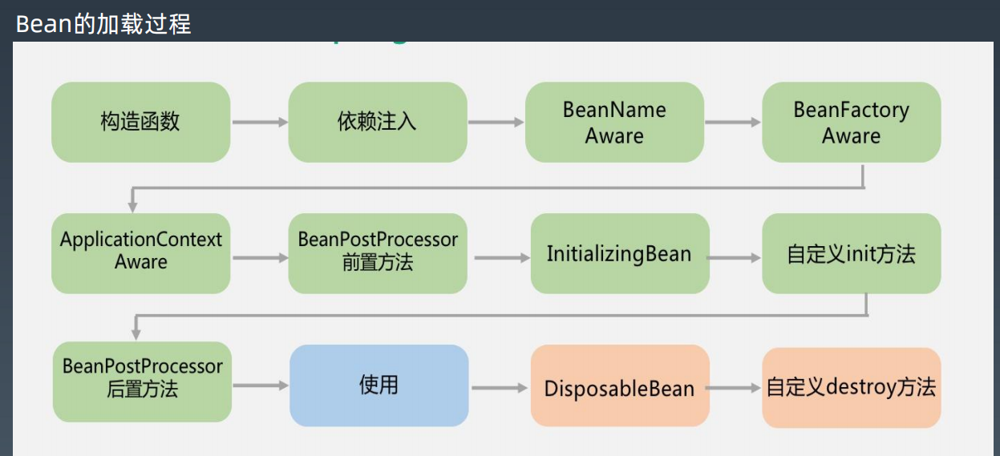
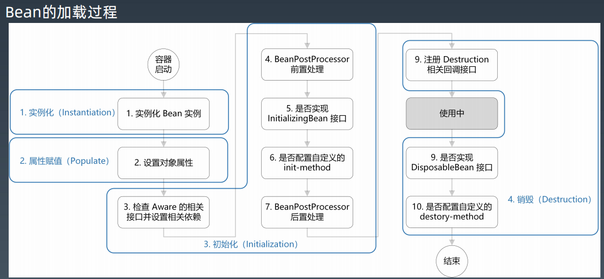

## 案例
- basic
    - 使用BeanPostProcessor实现一个接口多个实现的情况下，根据注解配置所注入的对象实例
- senior包
    - 模拟MyBatis

## spring 生命周期  

spring bean生命周期， 理解上面两个例子会更清楚：

>1、`BeanPostProcessor`接口中的两个方法都要将传入的bean返回，而不能返回null，如果返回的是null那么我们通过getBean方法将得不到目标。
>
>2、BeanFactory和ApplicationContext对待bean后置处理器稍有不同。ApplicationContext会自动检测在配置文件中实现了BeanPostProcessor接口的所有bean，并把它们注册为后置处理器，然后在容器创建bean的适当时候调用它，因此部署一个后置处理器同部署其他的bean并没有什么区别。而使用BeanFactory实现的时候，bean 后置处理器必须通过代码显式地去注册，在IoC容器继承体系中的ConfigurableBeanFactory接口中定义了注册方法
>
>3、不要将BeanPostProcessor标记为延迟初始化。因为如果这样做，Spring容器将不会注册它们，自定义逻辑也就无法得到应用。假如你在<beans />元素的定义中使用了'default-lazy-init'属性，请确信你的各个BeanPostProcessor标记为'lazy-init="false"'。

## 注意

目前偷懒起见，上面两个案例中`AnnotationConfigApplicationContext`扫描包时都是写死了包名，**如果需要更换包结构需要调整传入参数！**

## 参考资料   

- https://blog.csdn.net/geekjoker/article/details/79868945
- https://blog.csdn.net/geekjoker/article/details/80497913
