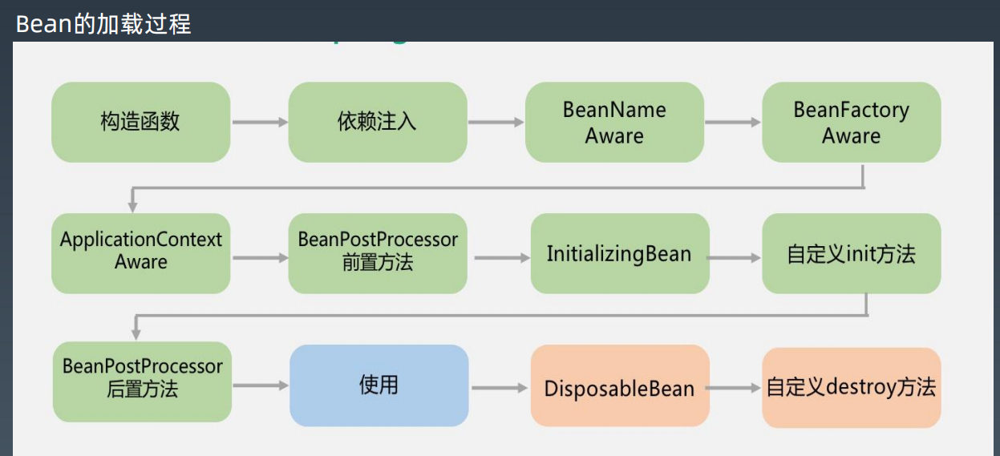
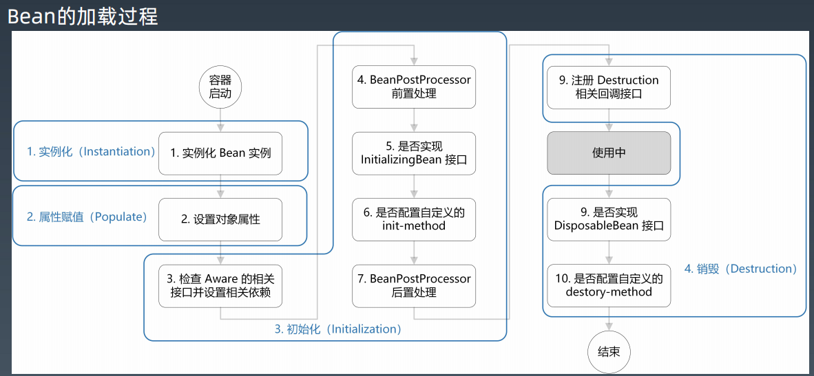

# BeanPostProcessor的使用  

本包的代码取自 [Spring实战系列（三）-BeanPostProcessor的妙用](https://blog.csdn.net/geekjoker/article/details/79868945)

## 说明

### 目标

同一个接口有多个实现类，在不同场景下需指定不同的实现类对象。

### 方式

- 方法1：直接通过ApplicationContext拿对象，可以抽象出一个工厂方法
   -  不够优雅
- 方法2：通过注解注入对象引用时，加个配置来指定将要使用哪个实现类。
   -  需要自定义BeanPostProcessor
### 程序说明

```text
├─beanpostprocessor
│  │  HelloServiceTest.java
│  │
│  ├─annotation //注解
│  │      RoutingInjected.java
│  │
│  ├─processor //通过自定义BeanPostProcessor的方式，在注入对象引用时，动态调整注入哪个实现类
│  │      //接口只有1个实现类，则直接注入；有多个实现类，则更新自定义注解RoutingInjected的值来注入所需实现类
|  | 	  HelloServiceBeanPostProcessor.java 
|  |	 //使用java反射、动态代理，生成一个proxy，proxy代理service接口，当需要获取bean时，该代理从spring容器根据传入名称拿对象
│  │      RoutingBeanProxyFactory.java
│  │
│  └─service //service接口以及该接口的2个不同的实现
│          HelloService.java
│          HelloServiceImpl1.java
│          HelloServiceImpl2.java
```

附上spring bean生命周期，理解会更清楚：






>1、接口中的两个方法都要将传入的bean返回，而不能返回null，如果返回的是null那么我们通过getBean方法将得不到目标。
>
>2、BeanFactory和ApplicationContext对待bean后置处理器稍有不同。ApplicationContext会自动检测在配置文件中实现了BeanPostProcessor接口的所有bean，并把它们注册为后置处理器，然后在容器创建bean的适当时候调用它，因此部署一个后置处理器同部署其他的bean并没有什么区别。而使用BeanFactory实现的时候，bean 后置处理器必须通过代码显式地去注册，在IoC容器继承体系中的ConfigurableBeanFactory接口中定义了注册方法
>
>3、不要将BeanPostProcessor标记为延迟初始化。因为如果这样做，Spring容器将不会注册它们，自定义逻辑也就无法得到应用。假如你在<beans />元素的定义中使用了'default-lazy-init'属性，请确信你的各个BeanPostProcessor标记为'lazy-init="false"'。
